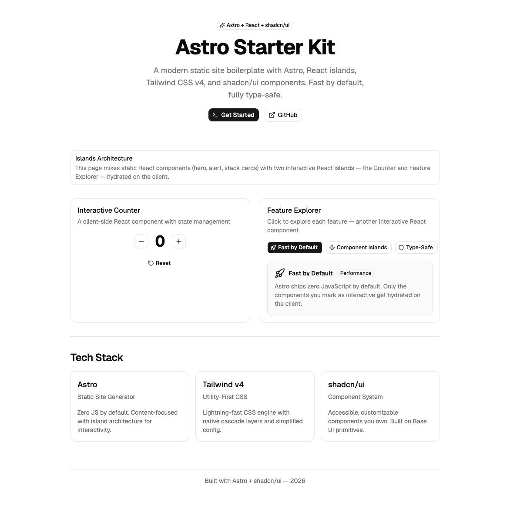

# Astro v7 Starter

A modern static site starter built with [Astro](https://astro.build), React islands, Tailwind CSS v4, and [shadcn/ui](https://ui.shadcn.com) components. Ships zero JavaScript by default — only interactive islands hydrate on the client.



## Tech Stack

- **Astro 7** — static site generator with island architecture
- **React 19** — for interactive client-side components
- **Tailwind CSS v4** — utility-first CSS with the new Vite plugin
- **shadcn/ui** — accessible component library built on Base UI primitives
- **Lucide React** — icon set
- **Geist** — variable font via Fontsource
- **@astrojs/sitemap** — automatic sitemap generation
- **Prettier** — code formatting with Astro and Tailwind plugins

## Getting Started

### Prerequisites

- Node.js >= 22.12.0

### Install

```bash
npm install
```

### Development

```bash
npm run dev
```

Opens at [http://localhost:4321](http://localhost:4321).

### Build

```bash
npm run build
```

Output goes to `dist/`. Preview the production build with:

```bash
npm run preview
```

### Format

```bash
npm run format
```

## Project Structure

```
src/
├── components/
│   ├── ui/            # shadcn/ui components (button, card, badge, etc.)
│   ├── Counter.tsx     # Interactive counter (React island)
│   ├── FeatureTabs.tsx # Interactive feature explorer (React island)
│   ├── Head.astro      # SEO meta tags, OG, Twitter cards, JSON-LD
│   └── StaticSections.tsx  # Server-rendered Hero, TechStack, Footer
├── layouts/
│   └── Layout.astro    # Base HTML layout with SEO props
├── pages/
│   ├── index.astro     # Home page
│   └── robots.txt.ts   # Dynamic robots.txt
└── styles/
    └── global.css       # Tailwind + shadcn theme variables
```

## Adding Components

```bash
npx shadcn@latest add <component>
```

Browse available components:

```bash
npx shadcn@latest search
```

## SEO

The project includes full SEO infrastructure out of the box:

- **Head.astro** — reusable component for meta, OG, Twitter cards, canonical URLs, and JSON-LD
- **Sitemap** — auto-generated via `@astrojs/sitemap`
- **robots.txt** — dynamically generated with sitemap reference
- **Trailing slashes** — enforced via `trailingSlash: 'always'`

Update `site` in `astro.config.mjs` to your production domain before deploying.

## License

MIT
